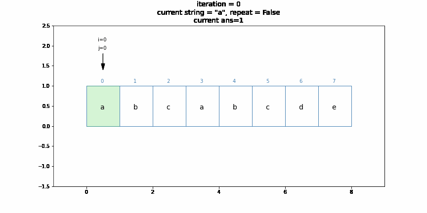
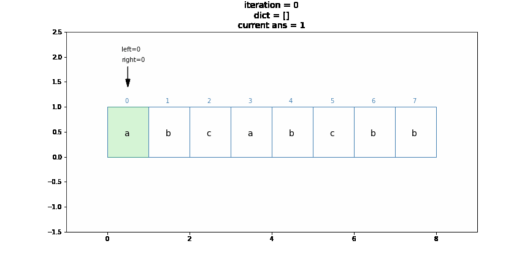

# Coding Problem and note

Just some notes for coding problems, algorithms and interesting code

## Latest

- Max Consecutive Ones
    

- Longest Substring Without Repeating Characters
    
    
    

## Usage

- Clone this repo
- In project directory, `pip install -r requirements.txt`
- Run jupyter `jupyter notebook`
- Check out http://localhost:8888/ and find some interesting algorithms to see

